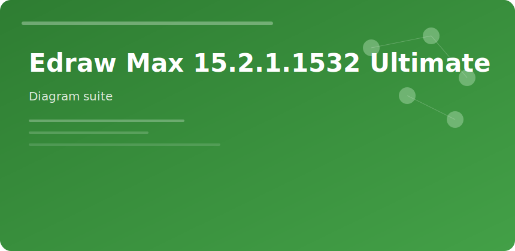

  

  

# Edraw Max 15 Ultimate

All-in-one diagramming when Visio licenses are tight but deliverables still need **network**, **UML**, and **office layout** symbols.

## Libraries

- Flowchart / BPMN
- Cisco-style network
- Org & mind map
- Floor plan with dimensions
- Gantt with dependencies

## Export targets

| Format | Use |
|--------|-----|
| PDF | Client sign-off |
| SVG | Wiki embedding |
| PPT | Slide decks |
| Visio | Cross-tool edit |

Ultimate tier unlocks full symbol count and cloud template sync for teams.

edraw max 15 diagram flowchart floor plan gantt ultimate
